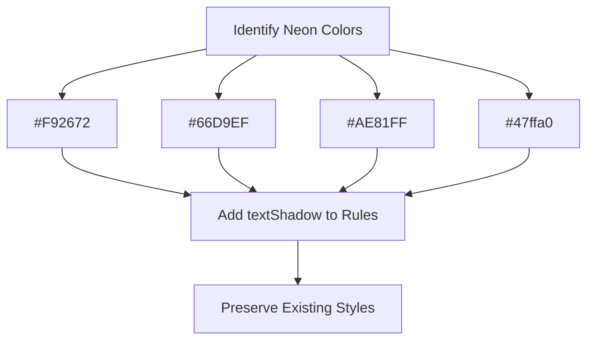

# SynthWave Dark Theme - Neon Glow Implementation Plan

## 1. Theme Properties Supporting Text-Shadow Effects
VS Code supports `textShadow` property in:
- `tokenColors` for syntax highlighting
- `workbench.colorCustomizations` for UI elements

**Format:** `"textShadow": "<color> <offsetX> <offsetY> <blurRadius>"`

## 2. Targeting Elements with Specific Colors
We'll target these neon colors:
- `#F92672` (pink) for variables and functions
- `#36f9f6` (cyan) for support functions
- `#AE81FF` (purple) for classes
- `#47ffa0` (green) for other elements

## 3. Theme File Modifications (`themes/synthwave-color-theme.json`)


### Specific Changes
```diff
// Variables
<<<<<<< SEARCH
    {
      "name": "Variable",
      "scope": ["variable", "entity.name.variable"],
      "settings": {
        "foreground": "#F92672"
      }
    },
=======
    {
      "name": "Variable",
      "scope": ["variable", "entity.name.variable"],
      "settings": {
        "foreground": "#F92672",
        "textShadow": "#F92672 0 0 8px"
      }
    },
>>>>>>> REPLACE

// Functions
<<<<<<< SEARCH
    {
      "name": "Function",
      "scope": ["entity.name.function", "variable.function"],
      "settings": {
        "foreground": "#F92672"
      }
    },
=======
    {
      "name": "Function",
      "scope": ["entity.name.function", "variable.function"],
      "settings": {
        "foreground": "#F92672",
        "textShadow": "#F92672 0 0 8px"
      }
    },
>>>>>>> REPLACE

// Support Functions
<<<<<<< SEARCH
    {
      "name": "Support function",
      "scope": "support.function",
      "settings": {
        "foreground": "#36f9f6"
      }
    },
=======
    {
      "name": "Support function",
      "scope": "support.function",
      "settings": {
        "foreground": "#36f9f6",
        "textShadow": "#36f9f6 0 0 6px"
      }
    },
>>>>>>> REPLACE
```

## 4. Extension Code Changes (`src/extension.ts`)
Add configuration option to toggle glow effects:
```typescript
// Add to activation function
context.subscriptions.push(vscode.workspace.onDidChangeConfiguration(e => {
  if (e.affectsConfiguration('synthwaveDark.enableGlow')) {
    vscode.commands.executeCommand('workbench.action.reloadWindow');
  }
}));
```

## 5. Package.json Updates
Add configuration option:
```diff
<<<<<<< SEARCH
  "main": "./dist/extension.js",
  "contributes": {
    "commands": [
      {
        "command": "hello-world.helloWorld",
        "title": "Hello World"
      }
    ]
  },
=======
  "main": "./dist/extension.js",
  "contributes": {
    "commands": [
      {
        "command": "hello-world.helloWorld",
        "title": "Hello World"
      }
    ],
    "configuration": {
      "title": "SynthWave Dark",
      "properties": {
        "synthwaveDark.enableGlow": {
          "type": "boolean",
          "default": true,
          "description": "Enable neon glow effects in the theme"
        }
      }
    }
  },
>>>>>>> REPLACE
```

## Compatibility Considerations
1. VS Code 1.12+ supports `textShadow`
2. Add version check in `extension.ts`:
```typescript
import * as semver from 'semver';

const MIN_VERSION = '1.12.0';
if (semver.lt(vscode.version, MIN_VERSION)) {
  vscode.window.showWarningMessage(
    `Neon glow effects require VS Code ${MIN_VERSION} or newer`
  );
}
```

## Implementation Steps
1. Update theme file with glow effects
2. Add configuration option to package.json
3. Implement version check in extension.ts
4. Add configuration change handler
5. Update documentation (README.md)